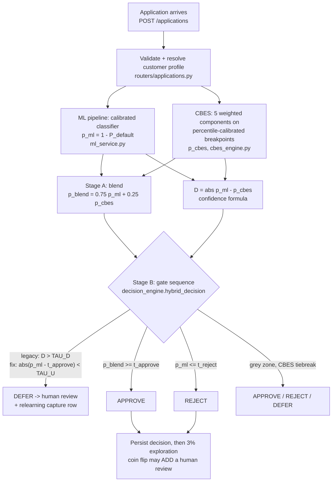

# Defence: the decision flow, the deferral finding, and the hybrid question

**Purpose.** This document is for speaking from. Every number in it traces to a file in this
repository; the source is named next to the claim. Nothing here is projected, hoped for, or
interpolated — where a question is unmeasured, it says "unmeasured".

**Direction convention (memorise this — getting it wrong inverts every conclusion).**
`p_ml` and `p_cbes` are both **approval probabilities**: P(good customer, no default).
Higher = better applicant. `risk_score = 1 − p_ml`. In `research/relearning/gate.py` and
`backend/artifacts/prediction_outputs.csv`, `y_true == 1` means GOOD (did not default).
The one exception: `reports/complementarity.json` works in P(default) space and says so in
its own `meta.label_convention` field.

---

## The direct answers first

1. **How is a decision made?** ML approval probability (75%) is blended with a rule-based
   score, CBES (25%); calibrated thresholds with a small CBES tilt (±0.0075 max) produce
   APPROVE / REJECT / DEFER through an ordered gate sequence
   (`backend/app/services/decision_engine.py`).

2. **What is the central finding?** The original deferral rule — defer when ML and CBES
   disagree by more than TAU_D — was measured to be **inverted**: it sent humans the cases
   the model was *most confident* about (gate z = +38.1 / +43.0, tens of standard deviations
   the wrong way; `reports/relearning_gate_before_deferral_fix.json`). Root cause was
   confirmed by measurement: ~65% of the "disagreement" is a fixed calibration offset
   between two differently-scaled scores. The fix — defer on model *uncertainty* — scores
   z = −99.7 at a matched ~22.7% rate (`reports/deferral_fix.json`).

3. **Does the ML+CBES hybrid improve accuracy?** **No.** Every honest combination of
   XGBoost and CBES is equal to or worse than XGBoost alone; a CV-honest stacker learns to
   ignore CBES (0.7650 vs 0.7651). No hybrid in the current roster beats XGBoost by more
   than the ±0.0036 fold-to-fold noise floor (`reports/complementarity.json`).

4. **So what hybrid should be built next?** None, yet. The one defensible next step is a
   ~13-GPU-minute TabPFN re-score with row IDs, evaluated against a decision rule stated
   *in advance* (§4.4). TabPFN is the only untested candidate with a plausible mechanism
   for helping; whether it does is currently **unanswerable** because the stored TabPFN
   probabilities cannot be aligned to rows.

---

## Part 1 — The decision flow, end to end

### 1.1 Diagram



### 1.2 Numbered walkthrough (against the code)

All step references: `backend/app/services/decision_engine.py` (`hybrid_decision`),
`backend/app/services/ml_service.py` (`MLPredictor.predict_application`),
`backend/app/routers/applications.py` (`_create_application_record`),
`backend/app/services/cbes_engine.py` (`compute_cbes`).

1. **Intake.** `POST /applications` validates the payload; a short-form submission with a
   `customer_id` is merged with the bank's on-file demographic/bureau block before scoring
   (`routers/applications.py::_validate_payload`).

2. **ML score.** Missing fields are imputed to conservative worst-case defaults
   (`cbes_engine.DEFAULTS`), then the calibrated pipeline scores the row. The serving
   artifact is `pipeline_v3_real.joblib` — a calibrated LogisticRegression trained on the
   real Home Credit extract with two leaked output columns removed. The engine score is
   `p_ml = 1 − calibrator.predict_proba(...)[:, 1]`, i.e. **P(approval)**
   (`ml_service.py`, ~line 279).

3. **CBES score.** Five components, each mapped through percentile breakpoints computed
   from the real training distribution (not hand-picked bank conventions), each softened
   by a k=4 sigmoid: credit 0.35 (external score + delinquencies), capacity 0.30
   (DTI + loan-to-income), behaviour 0.20 (active loans), stability 0.10 (tenure),
   region 0.05. The weighted sum passes a final k=5 sigmoid to give `p_cbes`
   (`cbes_engine.py::compute_cbes`).

4. **Stage A — blend.** `p_blend = 0.75·p_ml + 0.25·p_cbes` (`_BLEND_ALPHA = 0.25`,
   `decision_engine.py` line 81, formula line 193).

5. **Disagreement and confidence.** `D = |p_ml − p_cbes|` on the *raw* signals (not the
   blend). Confidence is

   ```
   confidence = 0.60·|p_ml − 0.5|·2 + 0.20·|p_cbes − 0.5|·2 + 0.20·(1 − D)
   ```

   clipped to [0, 1]; labels HIGH ≥ 0.75, MEDIUM ≥ 0.55, else LOW
   (`decision_engine.py` lines 200–207, 33–39).

6. **Thresholds and the CBES tilt.** `t_base` comes from the pipeline artifact (current v3
   artifact: **t_base = 0.65**, engine clip range [0.30, 0.98]). The tilt:

   ```
   tilt = clip(p_cbes − 0.5, −0.15, +0.15)
   t_approve = t_base − 0.05·tilt      # max shift ±0.0075
   t_reject  = t_base + 0.05·tilt
   ```

   A good CBES score *lowers* the approval bar by at most 0.0075; a bad one raises it
   (`decision_engine.py` lines 209–214).

7. **Stage B — gate order (mandatory).** In legacy (default) mode:
   - **Gate 2a:** `D > TAU_D` → **DEFER** ("disagreement"). TAU_D is loaded from the
     artifact; the calibrated production value documented across README.md and
     docs/REFERENCE.md is **0.43** (engine clamps to [0.10, 0.90]).
   - **Gate 2b:** `confidence < 0.18` → **DEFER** ("low_confidence").
   - **Gate 2c:** `p_blend ≥ t_approve` → **APPROVE** (blend, so CBES nudges approvals).
   - **Gate 2d:** `p_ml ≤ t_reject` → **REJECT** (raw p_ml, deliberately conservative).
   - **Grey zone:** `p_cbes ≥ 0.60` → APPROVE; `p_cbes ≤ 0.40` → REJECT; else **DEFER**
     ("grey_zone").

   In **uncertainty mode** (the measured fix, opt-in via
   `SMARTLEND_DEFERRAL_MODE=uncertainty`): `|p_ml − t_approve| < TAU_U` (default
   **TAU_U = 0.2458**, the tune-split quantile for a 22.5% deferral rate) → DEFER; else
   hard `p_ml ≥ t_approve` approve/reject — exactly the rule the evaluation scored, so the
   measured z-scores carry over unchanged (`decision_engine.py` lines 109–138, 222–238).

8. **Persist, then capture.** The decision is committed first; only then does the
   relearning-loop capture write a `deferred_reviews` row (for DEFERs and for the 3%
   exploration arm on auto-decisions). Capture failure can never change or block a
   decision — every capture helper swallows exceptions
   (`routers/applications.py`, failure-isolation block).

**Be ready to say plainly:** the production default is still the *legacy disagreement
router*. The measured fix is wired in behind an environment flag and is not the default
(`decision_engine.py` lines 100–108). That is a deliberate demo-stability choice, and it
means the running system still carries the defect described in Part 2 unless the flag is
set.

---

## Part 2 — The deferral rule was broken, and we measured exactly how

This is the project's central finding. Tell it straight: **we built a deferral rule on a
plausible premise, measured it, found it inverted, diagnosed the cause, fixed it, and
re-measured.**

### 2.1 What "working" means

Gate condition 1 (`research/relearning/gate.py`, CoDoC pattern): a working router must
hand humans a pile that is **harder than random selection** — closer to 50/50 good/bad,
and one the model is *less* accurate on. Both are scored as z-scores against a 200-trial
random-router null (seed 20260830). Working = **negative** z (threshold −2.0).

### 2.2 The original rule, measured (full 307,511-row artifact)

Source: `reports/relearning_gate_before_deferral_fix.json`.

| Metric | Value | Meaning |
|---|---|---|
| Balance-distance z | **+38.11** | deferred pile is 38 sd MORE lopsided (easier) than random |
| Accuracy z | **+43.01** | model is 43 sd MORE accurate on the deferred pile than random |
| Deferral rate | **51.76%** | vs AUC-implied natural-rate bound of [8.0%, 16.0%] |
| Deferred pile | 93.69% good | vs 90.03% good in the auto-decided pile |

The rule deferred the cases the model was most confident about — the exact opposite of
its job — and deferred more than half of all applications against a ceiling of 16%.

### 2.3 Root cause: a fixed calibration offset, confirmed by measurement

Source: `reports/deferral_fix.json → scale_offset_hypothesis` (`"confirmed": true`).

- mean `p_ml` = **0.9207**, mean `p_cbes` = **0.6133** → mean offset **+0.3074**
- `p_ml > p_cbes` on **98.4%** of rows
- mean `|D|` = 0.3103; subtracting the constant offset leaves **0.1078** — so **~65% of
  the "disagreement" magnitude is a fixed scale gap** between two differently-calibrated
  scores, not information
- corr(D, |p_ml − 0.5|) = **+0.376**: the offset *widens with model confidence*, so a
  threshold on D fires precisely on confident (easy) cases

**The decisive control:** holding the deferral rate at 22.58% (so threshold choice cannot
be blamed), the incumbent signal was **still inverted** — accuracy z = **+18.32**, balance
z = +15.83 (`deferral_fix.json → candidates_at_matched_rate[0]`). The defect is the
**signal**, not the threshold.

### 2.4 The fix, measured at a matched rate

Protocol: 50/50 tune/test split (seed 20260831), all fitting and threshold selection on
tune, all reported numbers on test (n = 153,756); every candidate's threshold set to the
tune quantile targeting 22.5% deferral; unmodified gate, 200 trials.

| Signal | Rate | Balance z | Accuracy z | Selective risk | vs random 0.0835 |
|---|---|---|---|---|---|
| `current_abs_diff` (incumbent) | 22.58% | **+15.83** | **+18.32** | 0.0907 | loses |
| `rank_diff` | 22.56% | −12.66 | −13.43 | 0.0785 | beats |
| `zscore_diff` | 22.65% | −42.51 | −49.21 | 0.0649 | beats |
| `isotonic_diff` | 22.66% | −66.04 | −70.59 | 0.0583 | beats |
| **`ml_uncertainty`** = −\|p_ml − t_approve\| | **22.70%** | **−92.50** | **−99.68** | **0.0451** | **beats** |
| `ml_uncertainty_0.5` | 22.68% | −90.21 | −92.72 | 0.0447 | beats |

Winner: **model uncertainty** — distance of `p_ml` from the actual decision boundary.
Gate condition 1 flips **FAIL → PASS**. The deferred pile is now **79.9% good vs 95.4%**
auto-decided (previously 93.7% vs 90.0% — the wrong way round), and model accuracy on it
drops to 78.6% vs 95.5% auto: humans finally get the hard cases. Selective risk 0.0451 vs
0.0835 for random abstention — **46% of the way from random to the oracle**
(`position_random0_oracle1 = 0.4597`).

### 2.5 The embedded negative finding (do not hide it)

Every *repaired* disagreement variant — rank-normalised, z-scored, even isotonic-calibrated
onto the labels — fixes the inversion but **still loses to plain model uncertainty**
(Chow's rule, the standard selective-prediction baseline). Ordering: uncertainty (−99.7)
≫ isotonic (−70.6) > z-score (−49.2) > rank (−13.4) ≫ incumbent (+18.3). The reason is in
Part 3: CBES carries almost no discriminative signal, so even perfectly calibrated
disagreement with it is mostly noise around the ML score.

### 2.6 The capacity-vs-AUC tension (own it before you're asked)

The 20–25% deferral rate is a **business requirement** (underwriter capacity), and it sits
above the AUC-implied natural-rate bound of [8.0%, 16.0%]. At 22.70%, roughly **29.5% of
deferrals are avoidable** — cases the model already decides correctly, deferred only
because capacity was set above what the model's discriminative power justifies. Gate
condition 2 therefore still FAILS at this rate, **and that is expected**: it is a capacity
decision made outside the model, not a router defect (`deferral_fix.json →
capacity_vs_auc_bound`). Conditions 3 (no exploration labels yet) and 4 (no retraining
design) also fail, so the overall verdict remains **do not open the retraining loop**.

---

## Part 3 — How ML and CBES work together, honestly

### 3.1 What each contributes in the live path

- **ML (`p_ml`)** carries essentially all discriminative power: XGBoost 0.7651 AUC on all
  307,511 out-of-fold rows (`reports/complementarity.json`).
- **CBES (`p_cbes`)** contributes 25% of the blend, tilts thresholds by at most ±0.0075,
  breaks grey-zone ties, and produces a five-component human-readable breakdown returned
  with every decision.

### 3.2 The premise that did not survive real data

The design premise was that ML-vs-rule *disagreement* marks hard cases. Measured:

- **CBES alone: AUC 0.5650** over all 307,511 OOF rows (random = 0.5).
- Every repaired disagreement variant lost to plain model uncertainty (§2.5).
- CBES **is** genuinely decorrelated — error correlation with XGBoost is **0.4388**,
  versus 0.97–0.994 for every other model pair in the roster. It is the only diverse
  signal in the system.
- But it loses to XGBoost in **all 16 segments examined** — EXT_SOURCE_2 quartiles, thin-file
  vs bureau, income quartiles, age bands — by 0.14 to 0.26 AUC. Its best showing is
  applicants 60+: 0.5813 vs XGBoost's 0.7190, still a 0.14 gap.

**Why diversity without competence buys nothing.** Averaging cancels *independent errors*,
but only when both voters are usefully right. At threshold 0.5 in approval space, XGBoost
and CBES disagree on 19.8% of applicants — and XGBoost is the one that's right in 17.6% of
all rows versus CBES's 2.1% (3.5 : 1). Blending a near-random voter into a strong one just
injects noise: the simple average scores 0.6850, **−0.0801 below XGBoost alone**, and the
weight sweep's optimum is **w_XGB = 1.0** — the data itself says "put zero weight on
CBES". Diversity is necessary for an ensemble; it is not sufficient.

### 3.3 What CBES is still legitimately for

Do not dismiss it, and do not oversell it:

- **Interpretability.** Every decision carries a five-component breakdown (credit,
  capacity, behaviour, stability, region) a customer or regulator can read. SHAP top-3 on
  a 100+-feature tree model is not the same kind of explanation.
- **Portability.** CBES consumes **8 fields** with plain business meanings
  (`cbes_engine.DEFAULTS`); the ML pipeline consumes ~129 dataset-specific engineered
  Home Credit columns. CBES survives a dataset change; the pipeline does not.
- **A bounded second opinion in the live path.** The ±0.0075 tilt and grey-zone tiebreak
  are small by construction, so CBES can nudge but never override ML discrimination.

What CBES is **not** for, on the evidence: accuracy, and deferral routing. Any claim for
CBES must be argued on interpretability grounds, not AUC.

---

## Part 4 — The hybrid: argued from measurements, not hope

### 4.1 What was measured (do not contradict these)

Source: `reports/complementarity.json`; noise floor = XGBoost's fold-to-fold AUC standard
deviation, **±0.0036** ("a gain smaller than that is not a gain").

| Combination (307,511 OOF rows) | AUC | vs XGBoost 0.7651 | Claimable? |
|---|---|---|---|
| XGBoost + CBES, simple average | 0.6850 | **−0.0801** (CI −0.0830 to −0.0772) | Actively hurts |
| XGBoost + CBES, rank average | 0.7067 | −0.0584 | Hurts |
| XGBoost + CBES, weight sweep | best at **w_XGB = 1.0** | ±0 | The sweep says: no CBES |
| XGBoost + CBES, honest CV stack | 0.7650 | −0.0001 | Meta-learner ignores CBES |
| XGBoost + LightGBM, best honest | 0.7662 | +0.0012 | No (< 0.0036) |
| XGBoost + CatBoost, best honest | 0.7672 | **+0.0021** (CI +0.0016 to +0.0026) | **No** (< 0.0036) |
| XGBoost + TabPFN | — | — | **UNANSWERABLE** (see 4.2) |

The XGBoost+CatBoost gain is directionally real (bootstrap CI excludes zero) but smaller
than the base model's own fold-to-fold noise: a future evaluation could not reliably
reproduce it. The 0.99+ error correlations across the tree family predicted exactly this —
there is almost no independent error left for averaging to cancel.

**The honest position: no hybrid in the current roster beats XGBoost alone by more than
noise.**

### 4.2 The TabPFN question is open, not answered

The stored TabPFN probabilities (`reports/_tabpfn_probs_5000.npy`) carried no row index.
The alignment gate failed: TabPFN's AUC on every attempted row reconstruction is
0.47–0.53 (expected ~0.7446), correlation with XGBoost 0.0109 (expected ~0.6), across 30
alternative reconstructions and a batch-of-500 permutation search. Every XGBoost+TabPFN
comparison was therefore **skipped** — this is a claim about *artifact provenance*, not
about TabPFN's quality. Its own holdout AUC of **0.7446, trained on 5,000 rows (~2% of
the training data)**, stands. A re-score saving `SK_ID_CURR` alongside each probability
is the fix (in progress; the original full scoring took 77 GPU-minutes for 61,503 rows, a
10,000-row re-score is ~13 minutes).

### 4.3 Where a partner would actually have to win

XGBoost's measured weak segments (`complementarity.json → segments`):

| Segment | n | XGBoost AUC | vs overall 0.7651 |
|---|---|---|---|
| Age 60+ | 35,301 | **0.7190** | −0.046 |
| EXT_SOURCE_2 Q2 | 76,710 | 0.7227 | −0.042 |
| Thin-file (no bureau) | 44,020 | **0.7353** | −0.030 |
| Under 30 | 45,186 | **0.7423** | −0.023 |

A global blend cannot help when errors are 0.99-correlated (the CatBoost result is the
proof). The only mechanism left for a hybrid to earn its place is **segment-local
competence**: a partner that beats XGBoost *somewhere specific*, so the combination (or a
router) can exploit it there. CBES is disqualified — it loses in all 16 segments including
these four. Within the roster, **TabPFN is the only untested candidate with a plausible
claim**: it is a different model class (a prior-fitted transformer, not gradient-boosted
trees), trained on a different principle, and it reached 0.7446 on ~2% of the training
data — so it is the only candidate that could plausibly break the 0.99 error-correlation
wall. Plausible is not proven; that is what the experiment is for.

### 4.4 The experiment, its cost, and the decision rule stated in advance

**Experiment.** Re-score TabPFN-2.5 on the 20% holdout, saving `SK_ID_CURR` with every
probability (two-column parquet/npz). Cost: **~13 GPU-minutes** for 10,000 rows (~807
defaults). The analysis in `research/analysis/complementarity.py` already contains the
full comparison pipeline behind the alignment gate; it runs automatically once a
correctly-indexed artifact exists — error correlation, per-segment AUCs, and honest hybrid
AUCs, with paired bootstrap.

**Statistical reality, admitted up front.** On ~10,000 rows, AUC differences carry
sampling error of roughly ±0.01, so only *paired* statistics (paired bootstrap on the same
rows, as implemented) can resolve anything near the noise floor.

**Decision rule — fixed now, before the data exist:**

- **BUILD** a hybrid (segment-routed or stacked) if BOTH hold:
  1. TabPFN beats XGBoost in at least one pre-named weak segment (age 60+, thin-file,
     under-30, EXT_SOURCE_2 Q2) with a paired-bootstrap 95% CI excluding zero; and
  2. the honest (CV-stacked or segment-routed, fit on tune, scored on test) combination
     beats XGBoost alone by **more than +0.0036 AUC** — the same noise-floor criterion
     that disqualified CatBoost's +0.0021.
- **KILL** the hybrid idea if TabPFN loses or ties XGBoost in all four pre-named segments,
  or if every honest combination's gain is ≤ +0.0036. In that case the roster is
  exhausted, XGBoost alone is the system, and the hybrid line of work ends with a
  documented negative result — which is a finding, not a failure.
- **No third option.** No post-hoc segment hunting beyond the four named above, no weight
  chosen on the evaluation data (the report itself labels that "an optimistic upper bound,
  not an honest estimate").

Pre-registering the rule is what makes this science rather than post-hoc justification:
the same criterion that would let us claim a TabPFN gain is the one that already forced us
to refuse the CatBoost gain.

---

## Questions you will be asked, with honest answers

**"Why is your deferral rate above the bound you yourselves computed?"**
Because 20–25% is an underwriter-capacity requirement set outside the model, and the
AUC-implied ceiling (16.0% at test AUC 0.765) is what the model's discriminative power
justifies. We computed the gap rather than hiding it: at 22.7%, ~29.5% of deferrals are
avoidable — cases the model already handles. Gate condition 2 fails at this rate by
construction and we say so in `docs/DEFERRAL-FIX.md`. If capacity is renegotiated, ≤16% is
where every referral is a case the model genuinely needs help on. What we fixed is *which*
cases fill the budget: within the mandated rate, the deferred pile went from 43 sd easier
than random to 99.7 sd harder.

**"If CBES scores 0.565 AUC, why keep it at all?"**
Not for accuracy — the measurements forbid that claim and we make no such claim. It stays
for three measured or structural reasons: (1) it is the only interpretable score in the
system — a five-component breakdown a customer can be given, versus SHAP values over ~129
engineered columns; (2) it is portable — 8 plain-meaning fields against a dataset-specific
pipeline; (3) its influence in the live path is bounded by construction (25% blend weight,
±0.0075 tilt) so it cannot override ML discrimination. What we *removed* is the one job it
was demonstrably bad at: deferral routing. And note its 0.4388 error correlation — it is
genuinely diverse; it just isn't competent, and we measured that diversity without
competence buys nothing.

**"Isn't your hybrid just an ensemble anyone could build?"**
The blend itself, yes — a weighted average is not a contribution and we don't claim it as
one. The contribution is the measurement discipline around it: (1) a confirmed root-cause
diagnosis of an inverted deferral rule, with a rate-matched control isolating signal from
threshold; (2) a negative result — repaired ML-vs-rule disagreement loses to Chow's-rule
uncertainty at every calibration level, with the ordering quantified; (3) an honest
complementarity audit showing the entire current roster adds nothing above the noise
floor, including a directionally-real CatBoost gain that we *refuse* to claim; and (4) a
pre-registered decision rule for the one open candidate. Anyone can average two models;
the defensible part is knowing, with measurements, when not to.

**"You said the hybrid helps — does it?"**
No, and we no longer say it. The ML+CBES blend does not improve ranking accuracy: simple
average −0.0801, honest stack −0.0001, optimal weight w_XGB = 1.0. The blend survives in
the live path as a bounded interpretability mechanism, not an accuracy mechanism, and the
25%-CBES demo default predates the complementarity measurement. No roster hybrid beats
XGBoost beyond ±0.0036 noise. The only version of "the hybrid helps" we defend is the
human-machine hybrid: uncertainty-routed deferral achieves selective risk 0.0451 vs 0.0835
for random abstention — 46% of the way to the oracle — and that is measured.

**"Your production system still runs the broken router?"**
Yes, by default — the fix is wired in behind `SMARTLEND_DEFERRAL_MODE=uncertainty` with
the measured TAU_U = 0.2458 as its default, and the demo default is unchanged
(`decision_engine.py`). That was a deliberate choice: nothing changes under the running
demo without explicit opt-in, and flipping the flag requires bumping `ENGINE_VERSION` so
relearning capture rows from the two routers stay separable. The defence position is that
the fix is measured, wired, tested (`research/tests/test_deferral.py`, 23 tests), and
switchable — not that it is silently live.

**"Why isn't the retraining loop open, since condition 1 now passes?"**
Because the gate requires all four conditions and three still fail: the deferral rate
exceeds the AUC-implied bound (capacity decision, §2.6), the exploration arm has not yet
accumulated ~1,000 un-selected labels, and no written retraining design models the
selection mechanism and reviewer bias. Retraining on router-selected, human-labelled cases
before then is the textbook runaway feedback loop (Ensign et al.), and the gate's default
verdict is refusal. Condition 1 was the data-quality defect; fixing it was this project's
contribution, not a licence to open the loop.

**"Your serving model is a LogisticRegression but your research numbers are XGBoost — which is it?"**
Both, stated precisely. The serving artifact (`pipeline_v3_real.joblib`) is a calibrated
LogisticRegression (t_base = 0.65); the research artifact (`prediction_outputs.csv`)
carries out-of-fold scores for all five models, and XGBoost (0.7651 OOF) is the reference
for the complementarity and hybrid analysis because it is the strongest. On the matched
benchmark (`reports/tabpfn_comparison.json`) LogisticRegression scores 0.7483 vs XGBoost's
0.7725 — the serving choice trades ~0.02 AUC for calibration quality and simplicity, and
swapping the active model is supported (`active_model.txt`). The deferral fix's z-scores
were computed against the artifact's `best_model_prob`; the uncertainty rule itself is
model-agnostic (distance from the acting model's own threshold).

---

## Source map

| Claim | Source |
|---|---|
| Blend, gates, tilt, confidence, TAU_U, engine flag | `backend/app/services/decision_engine.py` |
| p_ml direction, imputation, artifact loading, capture provenance | `backend/app/services/ml_service.py` |
| CBES components, weights, percentile calibration | `backend/app/services/cbes_engine.py` |
| Intake, persist-then-capture, exploration arm | `backend/app/routers/applications.py` |
| Gate definition, random-router null, four conditions | `research/relearning/gate.py` |
| Broken-router z = +38.1/+43.0, 51.76% rate | `reports/relearning_gate_before_deferral_fix.json` |
| Offset confirmation, matched-rate table, winner z = −99.68, capacity bound | `reports/deferral_fix.json`, `docs/DEFERRAL-FIX.md` |
| Candidate signals and protocol | `research/deferral/signals.py`, `research/deferral/evaluate.py` |
| CBES 0.5650 AUC, correlations, 16 segments, hybrid AUCs, TabPFN alignment failure | `reports/complementarity.json`, `docs/FUTURE-SCOPE.md` |
| TabPFN 0.7446 / 5,000 training rows; GBM benchmark AUCs | `docs/FUTURE-SCOPE.md`, `reports/tabpfn_comparison.json` |
| t_base = 0.65 in serving artifact; threshold methodology | `reports/t_base_selection.json`, `backend/artifacts/pipeline_v3_real.joblib` |
