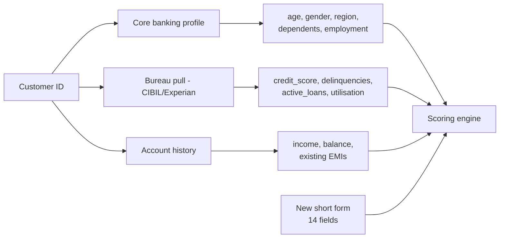

# Loan Application Form — Redesign

**Principle:** the applicant is an **existing bank customer**. The bank already holds their KYC, address, demographics and salary history. Asking for it again is a UX failure and looks naive to an evaluator.

**Grounded in** real Indian loan application forms: SBI Home Loan, SBI Agriculture (Co-applicant/Guarantor), HDFC Unsecured SME, IndusInd Business Loan, Central Bank Common Application, BoFA MSME.

---

## The problem with the current form

`backend/app/schemas.py → LoanApplicationInput` asks for **~30 fields**, and roughly half are things a bank with an existing account already knows:

| Currently asked | Bank already has it |
|---|---|
| `firstName`, `lastName` | ✅ KYC |
| `email`, `phone` | ✅ KYC |
| `age` | ✅ DOB on file |
| `gender`, `maritalStatus` | ✅ KYC |
| `city`, `region` | ✅ address on file |
| `dependents` | ✅ KYC / last update |
| `monthlyIncome`, `annualIncome` | ✅ salary credits |
| `employmentType`, `yearsOfEmployment` | ✅ last update |
| `bankBalance` | ✅ **it's their own bank** |
| `cibilScore` | ✅ **pulled from the bureau, never self-reported** |
| `totalLoans`, `activeLoans`, `closedLoans`, `missedPayments`, `creditUtilizationRatio` | ✅ bureau pull |

**`cibilScore` being a user input is the most serious issue.** No bank asks an applicant to type their own credit score — it is pulled from CIBIL/Experian. An evaluator will notice this immediately.

---

## What real bank forms actually ask

From the sources above, the sections that recur across every Indian lender:

| Section | Why it exists |
|---|---|
| **Loan details** | amount, purpose, tenure, repayment source |
| **End-use declaration** | RBI: funds must not be used for speculative or anti-social purposes |
| **Co-applicant / Guarantor** | separate form per guarantor; family details, income, relationship |
| **Security / collateral** | what is pledged, its value |
| **Obligations elsewhere** | loans at *other* institutions — the bank cannot see these |
| **Related-party declaration** | RBI: is the applicant a director of a bank, or related to one? |
| **Defaulter declaration** | confirmation of no wilful-default history |

---

## Proposed form — 3 sections, ~14 fields

### Section A · Loan request (6 fields)

| Field | Type | Notes |
|---|---|---|
| `loan_amount` | number | |
| `loan_purpose` | select | home improvement, education, medical, debt consolidation, business, vehicle, wedding, other |
| `loan_tenure_months` | select | 12 / 24 / 36 / 48 / 60 |
| `repayment_source` | select | salary, business income, rental, other |
| `preferred_emi_date` | select | 1st / 5th / 10th |
| `end_use_declaration` | checkbox | **RBI-required.** "Funds will not be used for speculative or anti-social purposes." |

### Section B · What the bank cannot see (5 fields)

| Field | Type | Why it must be asked |
|---|---|---|
| `obligations_other_banks` | number | EMIs at other lenders. The bank sees only its own accounts; bureau data lags 30–45 days. |
| `employment_changed_recently` | boolean | Job change in last 6 months materially changes risk and postdates the last KYC update. |
| `additional_income` | number | Rental, freelance, spouse income not visible in salary credits. |
| `collateral_offered` | select + value | none / property / gold / fixed deposit / vehicle |
| `is_related_party` | boolean | **RBI-required.** Director of a bank, or relative of one. |

### Section C · Guarantor (3 fields, conditional)

Shown only when the loan is unsecured **and** above a threshold — mirroring real forms, where a guarantor block is a separate annexure rather than always-on.

| Field | Type |
|---|---|
| `guarantor_required` | auto-computed, not user input |
| `guarantor_relationship` | select — spouse / parent / sibling / employer / other |
| `guarantor_customer_id` | string — if they also bank here, pull their profile instead of re-keying |

---

## Fields to remove entirely

```
firstName, lastName, email, phone, age, gender, maritalStatus,
city, region, dependents, monthlyIncome, annualIncome,
employmentType, yearsOfEmployment, bankBalance,
cibilScore, totalLoans, activeLoans, closedLoans,
missedPayments, creditUtilizationRatio
```

**~21 fields removed, ~14 added → roughly halves the form**, and every remaining question is one the bank genuinely cannot answer itself.

---

## Where the removed data comes from instead



**This makes CBES stronger, not weaker.** All 8 CBES inputs — `credit_score`, `delinquencies`, `active_loans`, `dti`, `employment_tenure_years`, `annual_income`, `loan_amount`, `region` — come from the bank's own systems and the bureau. Only `loan_amount` needs to be typed. Today the form invites users to *self-report* the bureau fields, which is both unrealistic and a data-quality risk.

---

## Suggested implementation order

1. **`schemas.py`** — new `LoanApplicationInput` with the 14 fields; add `customer_id`.
2. **Profile-lookup service** — resolves `customer_id` → the demographic and bureau block. For the demo this can read from the Home Credit row, which is realistic: `SK_ID_CURR` *is* a customer id.
3. **Frontend** — collapse to 3 sections; show a read-only "we already have this" panel so the reviewer can see the pulled data.
4. **Conditional guarantor block.**

Step 2 has a nice property for the demo: **the Home Credit dataset already is the "existing customer database."** Type a `SK_ID_CURR`, the profile populates from real data, and the applicant only fills the short form.

---

## Sources

- [SBI Home Loan Application Form](https://sbi.bank.in/documents/53471/263971/Home+Loan+Application-English.pdf/f5d46151-9626-3aae-917e-499d1ce3d002)
- [SBI Agriculture Loan — Co-applicant / Guarantor Form](https://sbi.bank.in/documents/14463/3756850/AGRICULTURE+LOAN+APPLICATION+FORM+-+CO+APPLICANT+-+GUARANTOR.pdf)
- [HDFC Bank Unsecured Loans Application Form](https://www.hdfc.bank.in/content/dam/hdfcbankpws/in/en/personal-banking/discover-products/msme/forms-centre-sme/application-form-unsecured-loans.pdf)
- [IndusInd Business Loan Application Form](https://www.indusind.bank.in/content/dam/indusind-corporate/loans/English/Business-Loan-Application-Form.pdf)
- [Central Bank of India Common Loan Application Form](https://centralbank.bank.in/sites/default/files/upload/Common_Application.pdf)
- [Bank of America MSME Common Loan Application Form](https://business.bofa.com/content/dam/flagship/in/en/regulatory-legal-and-policy-documents/MSME-Lending---Common-Loan-Application-Form.pdf)
