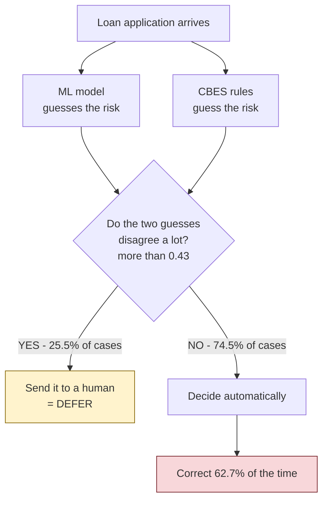
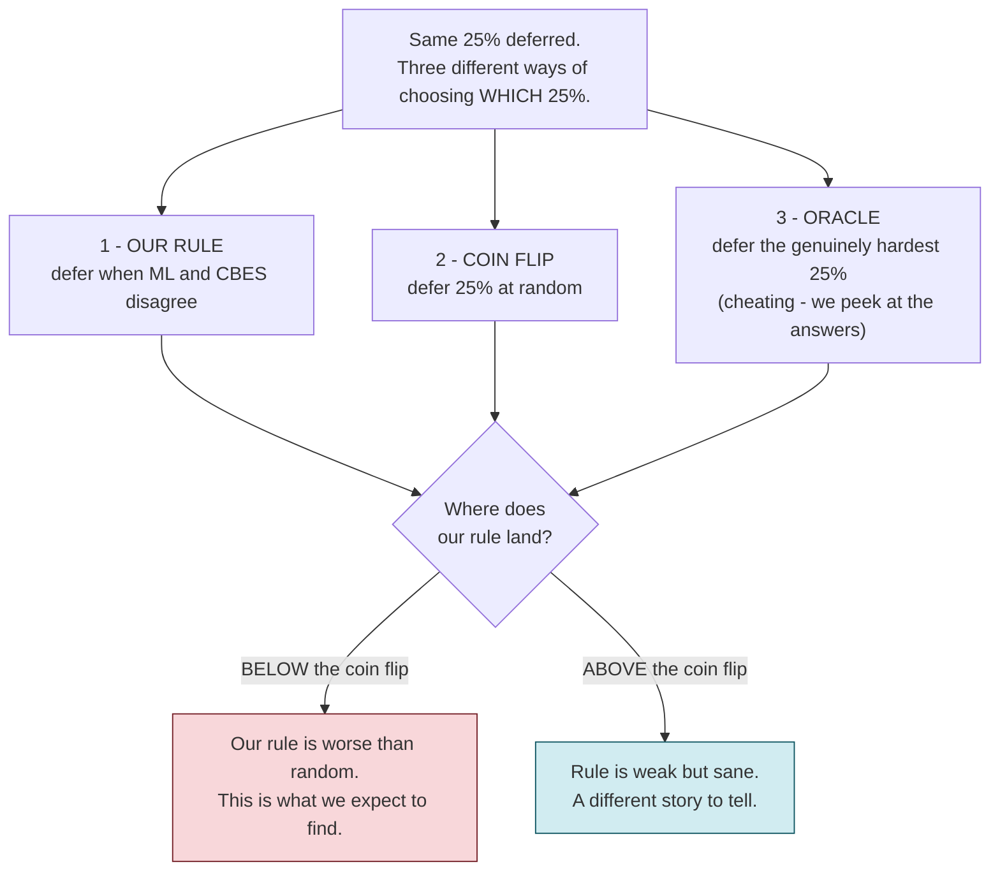

# This Week's Goal — in plain language

**Week 1 of 10** · 30 Aug – 5 Sep 2026 · Defense is **November 2026**

---

## The goal in one sentence

> **Prove, with a picture, that our system's "send it to a human" rule is broken — and that it is broken in an *interesting* way, not a boring way.**

That's it. One measurement, one figure. Everything else this week supports it.

---

## Part 1 — What our system does today



The idea sounds sensible: *"if my two methods argue with each other, I probably shouldn't trust either one — get a human to look."*

**But it doesn't work.**

---

## Part 2 — Why that 62.7% is the problem

Think of it like a student taking an exam where **skipping questions is allowed**.

| Student | What they skip | Result |
|---|---|---|
| Smart | the questions they *don't* know | score on answered questions goes **UP** |
| Confused | the questions they *do* know | score on answered questions goes **DOWN** |

Our system is the confused student.

```
        Accuracy on the cases the system decides BY ITSELF
        |
   80%  |
        |                                        +-- what SHOULD happen
   75%  |                                /-------+   (skip the hard ones)
        |                        /-------
   70%  |O-------------------------------------------  70.5%
        |                                              plain LogisticRegression,
   65%  |                                              which decides EVERYTHING
        |                        \-------
   60%  |                                \-------+
        |                                        +-- OUR SYSTEM - 62.7%
   55%  |
        +----+-----------+-----------+-----------+----->
           100%         90%         80%        74.5%
                share of cases decided automatically
```

Read it like this:

- The `O` on the left is a **simple model that answers every question**: 70.5% correct.
- Our system **refuses to answer 1 in 4 questions** — and still only gets 62.7% right on the rest.
- **Skipping a quarter of the work made it worse.** That should be impossible if the skipping is sensible.

So our system is not picking the hard cases to defer. It is picking roughly the *wrong* cases.

**And this is already after three attempted fixes.** The project's own report says so:

> *"Three structural fixes resolved the 57.7% non-deferred accuracy"*

It went 57.7% → 62.7%, still **7.8 points below** just using a simple model. Three fixes failed. That is the clue that this is not a bug to patch — it is the **wrong idea**.

---

## Part 3 — What we build this week

We measure our rule against two reference points. Three lines on one chart.



The **coin flip** is the line that matters. Deferring 25% of cases *at random* is the absolute floor — it requires no intelligence whatsoever.

**If our rule scores worse than the coin flip, we have our finding.** It means the disagreement signal isn't merely weak — it points the *wrong way*. Cases where ML and CBES argue are apparently the *easy* ones.

That is a real, reportable observation:

| | |
|---|---|
| "Our system underperforms" | an embarrassment |
| **"We measured why, and the mechanism is inverted"** | **a result** |

---

## Part 4 — The four tasks

| # | Task | Who | Why it matters |
|---|---|---|---|
| 1 | **The measurement above** | me | The figure your guide sees. The week's real output. |
| 2 | Fix `requirements-api.txt` | me | It is missing 7 packages the app actually imports (`sklearn`, `xgboost`, `shap`, …). Install from it today and the app crashes on startup. Verified. |
| 3 | ~~Download Home Credit~~ **DONE** | you | ✅ Arrived 30 Aug, verified. 307,511 real applicants + credit-bureau history merged in. |
| 4 | Stop treating `applicant_id` as a feature | me | An ID number says nothing about whether someone repays. Right now the model can see it. |

### Task 3 is done — the dataset arrived

`creddefer_full_merged.csv` — 307,511 real loan applications, verified as genuine
Home Credit data with credit-bureau history already merged in. We checked it and
the merge is sound.

Small fixes still needed on our side: three of our column names don't match the
file's, and a derived field needs cleaning. Half a day.

---

## Part 5 — What we are NOT doing this week

Not because the ideas are bad. Because there are only **5 weeks of research time before the report must be written**, and these don't fit inside it.

| Idea | Why not now | When instead |
|---|---|---|
| Better model from HuggingFace | A better model **does not change our result at all**. The gap we are measuring comes from *which applicants got labels*, not from the classifier. Swap LightGBM for a transformer and the gap is identical. | Later, optional |
| Sarvam voice feature | Was already first on the cut list before we knew about the November deadline. | Week 8 demo polish (~3 days) **if** research is on schedule |
| Relearning loop | Blocked at the foundation: the database has **one table** and records no human decisions and no repayment outcomes. Also real default labels take **12–24 months** to arrive — which is why banks rebuild scorecards yearly, not continuously. | Future-work section + viva answer |

### One important warning about the relearning loop

If we built it *now*, it would make things **worse on a schedule**:

```
   rule defers the EASY cases
             |
             v
   humans label the EASY cases
             |
             v
   we retrain on EASY cases
             |
             v
   model gets worse at HARD cases
             |
             v
   rule defers even more strangely  ---+
             ^                         |
             +-------------------------+
                   and round again
```

**The rule has to be fixed before the loop can ever be closed.** That is another reason this week's measurement comes first.

There *is* a genuinely good idea hiding in the relearning loop, and it is worth saving for the viva: deferring a case to a human is a way of **collecting data you could never otherwise get**, about applicants the old policy always rejected. That turns deferral from "a cost we minimise" into "the thing that makes the impossible cases possible." Excellent future work. Not code before November.

---

## Part 6 — How we know the week succeeded

- [ ] A chart with three lines: our rule, coin flip, oracle
- [ ] A one-line answer to *"is our rule better or worse than random?"*
- [ ] `requirements-api.txt` installs an app that actually starts
- [ ] Home Credit on disk, its columns verified against our schema
- [ ] `applicant_id` no longer used as a feature

**If the first two are done, the week worked** — even if nothing else gets finished.

---

## Why this is the right thing to be doing

You have a system that underperforms and three failed attempts to fix it. There are two ways to walk into a defense:

> ❌ *"We built a hybrid system. It gets 62.7%. We tried three fixes."*

> ✅ *"We built a hybrid system, measured it properly, and found the deferral mechanism is inverted — it defers the easy cases. Here is the measurement, here is why the standard fix for this problem cannot work in lending, and here is what would."*

The second one is a research project. The difference between them is **this week's chart**.
